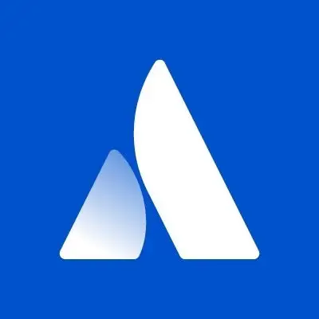
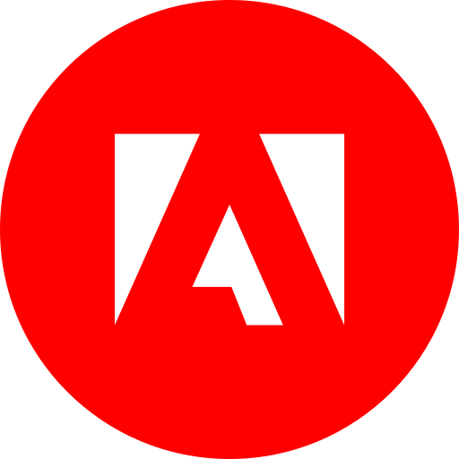
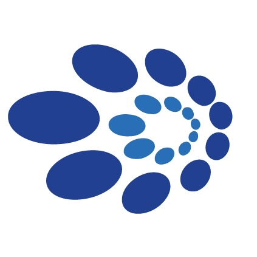
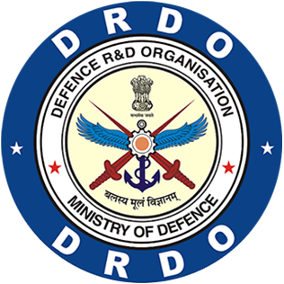

<div align="center">

# 👋 Hey there, I'm **Jatin K Malik**

### `Principal Software Engineer` | `System Architect` | `Distributed Systems Expert`

[](https://git.io/typing-svg)

</div>

## 🎯 **What I Do**

I architect and scale **distributed systems** that serve millions of users. Currently building the future of collaborative work at **Atlassian**, previously shaped ride-sharing infrastructure at **Uber**.

```python
class JatinKMalik:
    def __init__(self):
        self.role = "Principal Software Engineer"
        self.location = "San Francisco Bay Area, CA"
        self.experience = "15+ years"
        self.mission = "Solving hard engineering problems at scale"
    
    def current_focus(self):
        return [
            "🏗️ Building A2A (Agent-to-Agent) AI platforms",
            "⚡ Performance engineering & optimization",
            "☁️ Multi-cloud infrastructure (AWS/GCP/Azure)",
            "🤖 Enabling autonomous AI agents to collaborate"
        ]
    
    def get_inspired_by(self):
        return "The challenging creative process behind building something new"
```

## 💼 **Professional Journey**

<div align="center">

### **Where I've Worked**

<a href="https://www.atlassian.com"></a>
<a href="https://www.uber.com"></a>
<a href="https://www.synaptic.com"></a>
<a href="https://www.crunchbase.com/organization/shuttl"></a>
<a href="https://www.adobe.com"></a>
<a href="https://www.webyog.com"></a>
<a href="https://mvp.microsoft.com/studentambassadors"></a>
<a href="https://www.drdo.gov.in"></a>

</div>

## 🛠️ **Tech Stack**

### **Languages**


### **Databases & Storage**


### **Cloud & Infrastructure**


### **Hardware & IoT**


## 📊 **GitHub Activity**

<div align="center">

[](https://git.io/streak-stats)

</div>

## 🎓 **Human Skills**

Beyond code, I bring:

- 🎯 **Leadership** - Leading teams and driving technical decisions
- 🧩 **Problem Solving** - Breaking down complex challenges into elegant solutions  
- 👨‍🏫 **Mentorship** - Guiding engineers to reach their full potential

## 🌐 **Let's Connect**

<div align="center">

[](https://x.com/intent/user?screen_name=jatinkrmalik)
[](https://linkedin.com/in/jatinkrmalik)
[](https://youtube.com/@jatinkrmalik)
[](https://j47.in)
[](https://jatinkrmalik.com)
[](mailto:jatinkrmalik@gmail.com)

</div>

## 💡 **Philosophy**

> *"It is not the actual work but the challenging creative process that goes behind it which inspires me to think out of the box to do something new, something satisfactory!"*

## 🎯 **Always Open To**

- 🤝 **Collaboration** on interesting projects
- 💬 **Technical discussions** about distributed systems, AI, and scalability
- 🎤 **Speaking opportunities** at conferences and meetups
- 📧 **Direct contact** for challenging problems that need solving

---

<div align="center">

### 💬 *"If you've got a challenge that needs a creative solution, let's talk!"*

[](https://github.com/jatinkrmalik)

</div>

---

<div align="center">

**⭐ Star my repositories if you find them helpful!**

</div>
